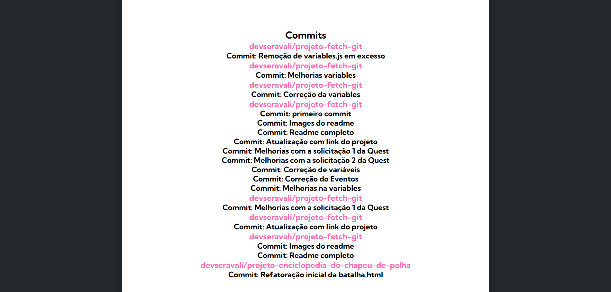

# 🔍 GitHub User Search
Aplicação web que permite consultar perfis de usuários do GitHub e listar seus repositórios públicos.
Construída com HTML, CSS e JavaScript, a integração com a API pública do GitHub é realizada via Fetch API, proporcionando uma experiência leve e intuitiva.

## 🚀 Funcionalidades
- Buscar usuários do GitHub pelo nome de usuário.
- Visualizar perfil: foto, nome, bio, localização, quantidade de repositórios.
- Listar repositórios com nome, descrição e link direto para o GitHub.

## 🛠 Tecnologias
- HTML5
- CSS3
- JavaScript (ES6)
- Fetch API
- Font Awesome (para ícones)

## Link do projeto
O projeto está disponível para teste online. Acesse a demo [clicando aqui](https://devseravali.github.io/projeto-fetch-git/)


## 🖼 Prints da aplicação
**Tela Inicial**


**Resultado de Busca**


**Lista de Commits**


**Lista de Repositórios**


## 📂 Estrutura do projeto
```
Projeto-fetch-git/
── index.html
├── readme.md
├── src/
│ ├── css/
│ │ ├── reset.css
│ │ ├── style.css
│ │ └── responsivo.css
│ ├── images/
│ │ ├── tela-inicial.png
│ │ ├── resultado-de-busca.png
│ │ ├── lista-de-repositorios.png
│ │ └── commits.png
│ └── js/
│ ├── index.js
│ ├── variables.js
│ ├── objects/
│ │ ├── screen.js
│ │ └── user.js
│ └── services/
│ ├── user.js
│ └── repositories.js
```

## 🔹Melhorias Implementadas (Desafio Avançado da Quest)
- 📊 Últimos eventos do usuário:
Listagem de até 10 últimos eventos do usuário.
Exibe apenas os eventos:
PushEvent → mostra nome do repositório e mensagem de commit.


- 📂 Repositórios

Agora além do nome e link do repositório, também são exibidas:

⭐ Quantidade de estrelas

🍴 Quantidade de forks

👀 Quantidade de watchers

💻 Linguagem principal do repositório

_ _ _ 

### 🙏 Agradecimentos
O projeto foi desenvolvido como exercício prático durante o curso DevQuest FrontEnd do Dev em Dobro.
Agradeço aos instrutores e à equipe do curso pelo conteúdo de qualidade e pelas oportunidades de aprendizado.