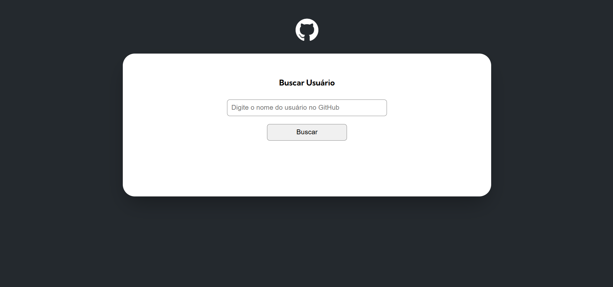
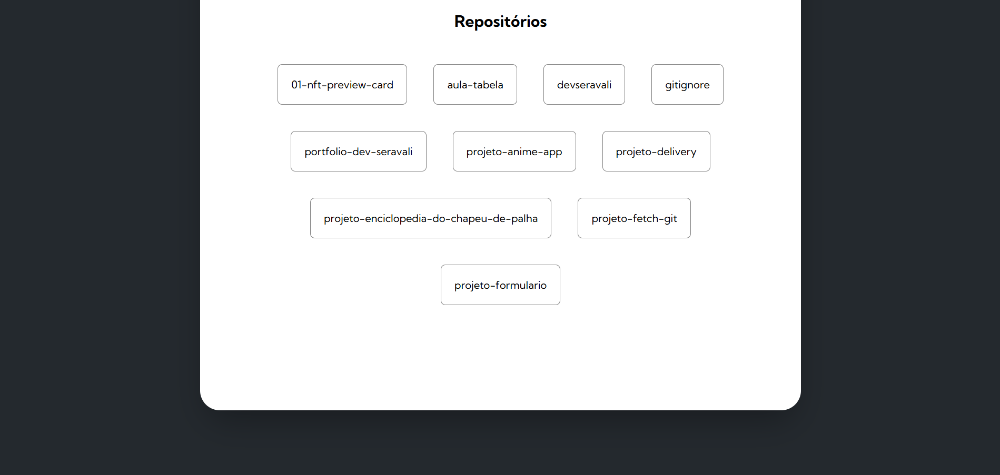

# 🔍 GitHub User Search
Aplicação web que permite consultar perfis de usuários do GitHub e listar seus repositórios públicos.
Construída com HTML, CSS e JavaScript, a integração com a API pública do GitHub é realizada via Fetch API, proporcionando uma experiência leve e intuitiva.

## 🚀 Funcionalidades
- Buscar usuários do GitHub pelo nome de usuário.
- Visualizar perfil: foto, nome, bio, localização, quantidade de repositórios.
- Listar repositórios com nome, descrição e link direto para o GitHub.

## 🛠 Tecnologias
- HTML5
- CSS3
- JavaScript (ES6)
- Fetch API

## 🖼 Prints da aplicação
**Tela Inicial**


**Resultado de Busca**


**Lista de Repositórios**


## 📂 Estrutura do projeto
```
projeto-fetch-git/
├── index.html
├── src/
│ ├── css/
│ │ ├── reset.css
│ │ ├── responsivo.css
│ │ └── style.css
│ ├── js/
│ │ ├── index.js
│ │ ├── variables.js
│ │ ├── objects/
│ │ │ ├── screen.js
│ │ │ └── user.js
│ │ └── services/
│ │ ├── repositories.js
│ │ └── user.js
```
_ _ _ 

### 🙏 Agradecimentos
O projeto foi desenvolvido como exercício prático durante o curso DevQuest FrontEnd do Dev em Dobro.
Agradeço aos instrutores e à equipe do curso pelo conteúdo de qualidade e pelas oportunidades de aprendizado.